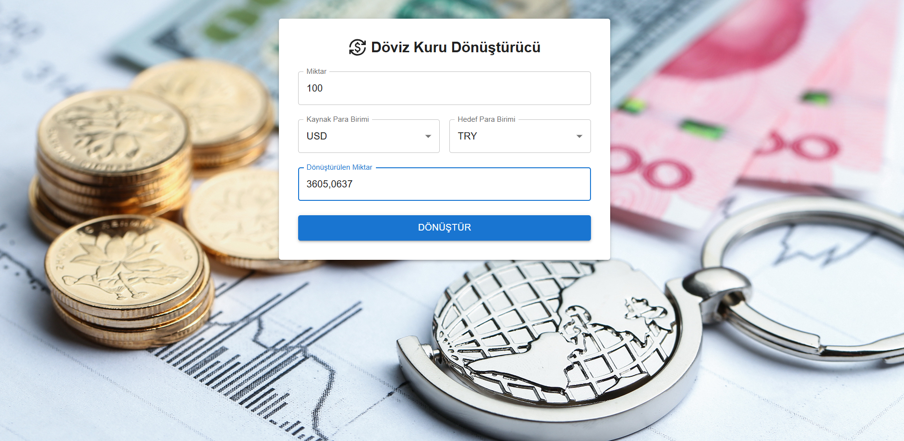

# Döviz Kuru Dönüştürücü 💱



## 📝 Proje Hakkında

Bu proje, React ve Material UI kullanılarak geliştirilmiş modern bir döviz kuru dönüştürme uygulamasıdır. Kullanıcılar, farklı para birimleri arasında güncel kurlar üzerinden dönüşüm yapabilirler.

## ✨ Özellikler

- 30+ farklı para birimi desteği
- Gerçek zamanlı döviz kuru verileri
- Modern ve kullanıcı dostu arayüz
- Responsive tasarım
- Kolay kullanım

## 🛠️ Kullanılan Teknolojiler

- [React](https://reactjs.org/)
- [Material UI](https://mui.com/)
- [Axios](https://axios-http.com/)
- [FreeCurrencyAPI](https://freecurrencyapi.com/)
- [Vite](https://vitejs.dev/)

## 📦 Projeyi Çalıştırma
## ⚙️ Kurulum

1. Bu repoyu klonlayın:
   ```bash
   git clone https://github.com/kadirn7/DovizKuru-CurrencyAppReact
   cd DovizKuru-CurrencyAppReact
   ```

2. Gerekli paketleri yükleyin:
   ```bash
   npm install
   ```

3. Uygulamayı başlatın:
   ```bash
   npm run dev
   ```

4. Gerekli Meterial UI kütüphanelerini yükleyin:
   ```bash
   npm install @mui/material @emotion/react @emotion/styled @mui/icons-material
   ```
5-FreeCurrencyAPI için bir api key alın:
 - [FreeCurrencyAPI](https://freecurrencyapi.com/) sitesine gidin
   - Ücretsiz kayıt olun
   - API anahtarınızı alın
 6. Uygulamayı çalıştırın:
   ```bash
   npm run dev
   ```


## 💻 Kullanım

1. Dönüştürmek istediğiniz miktarı girin
2. Sol taraftan kaynak para birimini seçin
3. Sağ taraftan hedef para birimini seçin
4. "Dönüştür" butonuna tıklayın
5. Dönüştürülen miktar otomatik olarak görüntülenecektir

## 🔑 API Yapılandırması

Currency.jsx dosyasında API anahtarınızı ayarlayın:
```javascript
let ApiKey = "YOUR_API_KEY_HERE";
```

## 📱 Responsive Tasarım

Uygulama aşağıdaki cihazlarda sorunsuz çalışacak şekilde tasarlanmıştır:
- 📱 Mobil telefonlar
- 📱 Tabletler
- 💻 Dizüstü bilgisayarlar
- 🖥️ Masaüstü bilgisayarlar

## 🤝 Katkıda Bulunma

1. Bu projeyi fork edin
2. Yeni bir branch oluşturun (`git checkout -b feature/AmazingFeature`)
3. Değişikliklerinizi commit edin (`git commit -m 'Add some AmazingFeature'`)
4. Branch'inizi push edin (`git push origin feature/AmazingFeature`)
5. Pull Request oluşturun

## 📄 Lisans

Bu proje MIT lisansı altında lisanslanmıştır. Detaylar için [LICENSE](LICENSE) dosyasına bakınız.

## 🌟 Görseller

Uygulamanın ekran görüntüsü:


## 📞 İletişim

Proje Linki: [https://github.com/kadirn7/DovizKuru-CurrencyAppReact](https://github.com/kadirn7/DovizKuru-CurrencyAppReact)
